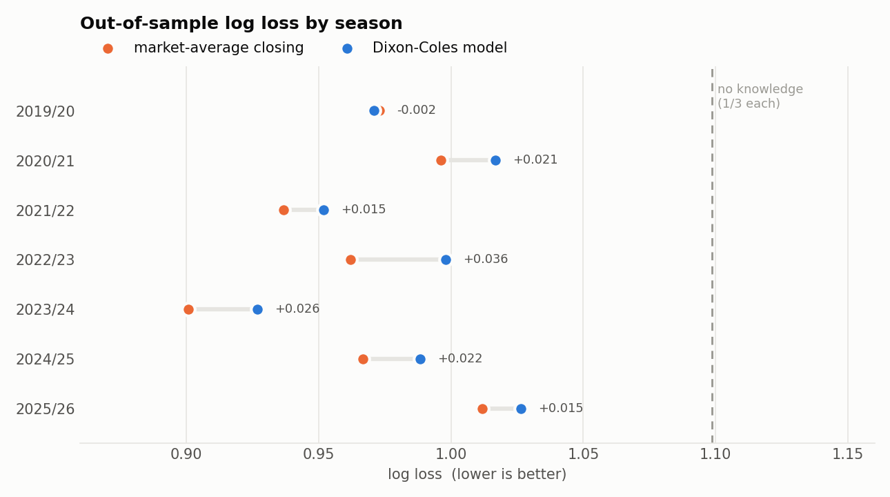
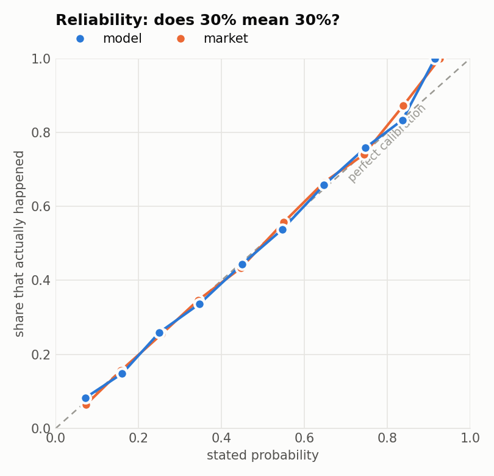
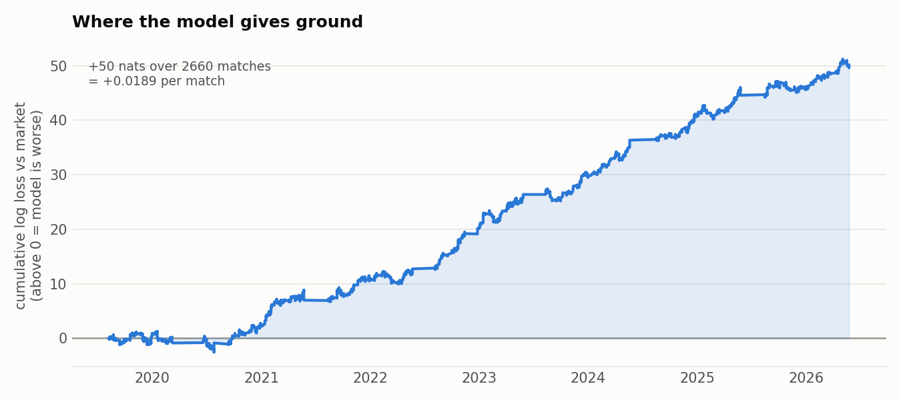
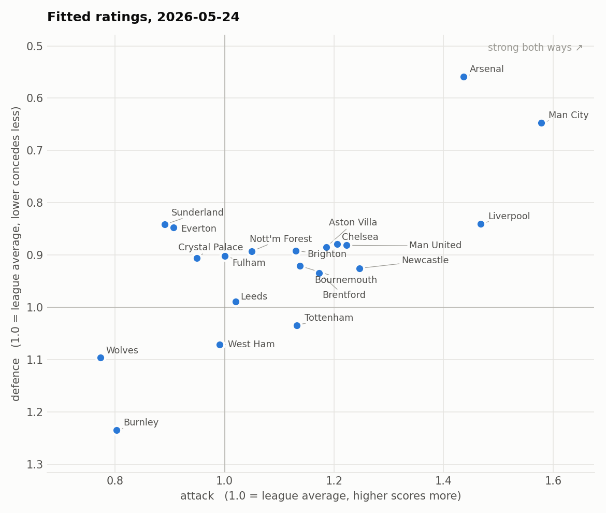

# Premier League match forecasting — Dixon-Coles vs the closing line

A Dixon-Coles goals model for the English Premier League, backtested walk-forward
over nine seasons and scored, on the seven with a published market-average close,
against that closing line — the market after all the informed money has moved it.

> **This is the research.** The same model runs in production at
> [proofodds.com](https://proofodds.com), where every prediction is sealed and hashed before
> kickoff and the live record is published whatever it says —
> [GitSimaao/proofodds](https://github.com/GitSimaao/proofodds). This repository is where the numbers
> that site quotes come from, and how to reproduce them.

**Headline result: the model does not beat the market, and it was never likely to.**
Over 1,900 held-out matches it loses **0.0227 nats per match** in log loss to the
closing line (0.9783 vs 0.9556). Pooled with the market it adds nothing
(+0.0022). That is the honest finding, and it is the point of the exercise: the
question "do I have an edge?" has an answer, and the answer here is no.

> **Benchmark note (January 2026).** Until mid-January 2026 the benchmark was
> Pinnacle's closing price; football-data.co.uk then stopped carrying those
> columns, and every number here was recomputed against the market-average close
> (`AvgC*`), which exists for every match from 2019/20. On the 2,490 matches
> carrying both prices the two de-vigged benchmarks differ by 0.0001 nats —
> the production repo's `scripts/check_benchmark.py` reruns that measurement.
> On the old benchmark the same walk-forward read: model 0.9654, market 0.9484
> over 3,250 matches of 2017/18–2025/26.



---

## Results

Everything below is strictly out of sample: to price a match on date *D*, the
model has only seen matches played before *D*.

| period | matches | model | market | blend (22% model) |
|---|---|---|---|---|
| **Test** 2021/22 – 2025/26 | 1,900 | 0.9783 | **0.9556** | 0.9578 |
| Validation (graded part) 2019/20 – 2020/21 | 760 | 0.9938 | 0.9846 | 0.9837 |
| All graded 2019/20 – 2025/26 | 2,660 | 0.9827 | 0.9639 | 0.9652 |

Log loss, lower is better. Two reference points frame the scale: predicting
1/3-1/3-1/3 every week scores **1.0986**, and the closing line scores **0.9639**
across all 2,660 priced matches. So *everything anyone knows about football* is
worth about 0.135 nats. The model captures roughly six sevenths of that gap and
gives up the last seventh.

| | model | market |
|---|---|---|
| log loss | 0.9827 | 0.9639 |
| RPS | 0.2030 | 0.1968 |
| top pick correct | 52.7% | 55.0% |

The hyperparameters and the blend weight were chosen on the validation period and
never touched again; the test period informed no decision.

### It is well calibrated but not sharp enough



When the model says 30%, it happens about 30% of the time — the reliability curve
sits on the diagonal as tightly as the market's does. Rescaling the probabilities
with a temperature parameter fitted on validation improves the test log loss by
0.0002, i.e. nothing. So the gap is **not** miscalibration. It is sharpness: the
market knows things this model cannot see, and moves further from the base rates
when it is right to.

That is expected. This model's entire input is *who played whom and how many goals
were scored*. It has never heard of an injury, a suspension, a Thursday night in
Baku, a manager sacked on Monday, or a side that has already secured the title.
The closing line has heard all of it.

### Where the ground is lost



The cumulative curve rises fairly steadily rather than in one collapse — this is
a persistent small deficit, not a handful of blown-up matches. The flat stretch
through 2019/20 is the model briefly keeping pace during the empty-stadium
period, when home advantage collapsed and the market took time to reprice it.

### Fitted ratings



Two by-products worth noting, both of which fall out of the fit rather than being
assumed:

- **Home advantage has faded.** The estimate of γ drifts from 1.30 in 2017/18 to
  about 1.17 in 2025/26. The drop happens across the empty-stadium seasons and
  does not fully recover.
- **The Dixon-Coles low-score correction is weakening.** ρ moves from about −0.09
  to roughly −0.02/−0.04. The dependence the 1997 paper found in 1990s English
  football is a good deal weaker in the modern game.

---

## How it works

### 1. Two numbers per team

Every team gets an **attack** rating α and a **defence** rating β, plus one
league-wide **home advantage** γ. Expected goals for a fixture:

```
λ_home = α_home × β_away × γ × league_mean
λ_away = α_away × β_home     × league_mean
```

α = 1.0 is league average; β below 1.0 means conceding less than average.
Internally everything is on the log scale, which keeps the optimiser unconstrained:

```
log λ_home = μ + h + a[home] + d[away]
log λ_away = μ     + a[away] + d[home]
```

### 2. From expected goals to three probabilities

Goals are modelled as Poisson counts. Two Poissons multiply into a 11×11 grid of
scorelines, and the grid sums into the three outcomes: below the diagonal is a
home win, the diagonal is a draw, above it is an away win.

### 3. What Dixon-Coles adds to that

**A low-score correction.** Independent Poissons say the two teams' goal counts
are unrelated. They are not: 0-0 and 1-1 happen more often than the maths says,
1-0 and 0-1 less often, because a level game is played differently from a decided
one. Dixon-Coles multiplies exactly four cells of the grid by a factor τ:

```
τ(0,0) = 1 − λμρ      τ(0,1) = 1 + λρ
τ(1,0) = 1 + μρ       τ(1,1) = 1 − ρ
```

With ρ negative, the two level scorelines go up and the two one-goal ones go
down. The four adjustments cancel exactly, so the grid still sums to one.

**Exponential time decay.** A match from 2016 says nothing about the Liverpool of
today. Each match enters the likelihood with weight `exp(−ξ · days_ago)`. The
tuned value, ξ = 0.002/day, is a **half-life of 347 days**.

### 4. Fitting

The 2 × 34 + 3 parameters are left as unknowns and chosen by maximum penalised
likelihood — the combination under which the observed results are least
surprising, weighted by recency. The model knows nothing about football; it
pushes numbers around until the data stops being surprising.

Two implementation notes that matter:

- **Analytic gradient.** `dixon_coles._objective` returns the gradient alongside
  the objective, so L-BFGS-B converges in milliseconds instead of seconds. Without
  it, refitting on ~1,200 successive dates per backtest pass would be impractical
  — and the hyperparameter grid runs 50+ passes.
- **A Gaussian prior on the ratings** (a ridge penalty, σ = 0.6 tuned on
  validation). It pins down the shift degeneracy between attack and defence, and
  it solves the promoted-team problem: a side with no Premier League history
  starts at exactly league average and shrinks towards its real level as matches
  arrive, rather than being unidentified.

---

## The rule that makes the numbers mean anything

**Walk-forward, no exceptions.** To predict a match on date *D*, the model may only
see matches played strictly before *D*. Fit on everything and then "predict" the
past and the results come out spectacular and worthless — that is lookahead bias,
and it invalidates most amateur backtests.

Here it is enforced structurally rather than by care: matches are sorted by date
once, and the training slice is taken with `searchsorted`, so a future match
physically cannot enter a fit. The model is refitted on **every match date** —
about 1,200 fits per pass.

The same discipline applies to the hyperparameters. ξ and the prior width were
chosen on the 2017/18–2020/21 validation window (when the old Pinnacle benchmark
still existed) and then frozen; the blend weight is fitted on the graded part of
the same window. Picking them on the data you report is just a slower form of
the same bias.

---

## What is deliberately *not* claimed

- **The staking simulation is a diagnostic, not a P&L.** `betting_simulation()`
  stakes fractional Kelly against the closing price and, unsurprisingly given the
  log loss, loses (−12.3% ROI on the test period). Even a positive number there
  would not have meant much: you cannot bet into a closing line, you would have
  had to bet hours earlier at worse prices, and anyone who consistently beat
  the close would be limited long before the sample ended.
- **De-vigging is proportional**, the simplest method. It slightly overstates
  longshot probabilities relative to Shin or power methods, which if anything
  flatters the model.
- **The first four seasons train but are not graded.** The market-average close
  is published from 2019/20, so 2015/16–2018/19 feed the fits — they are real
  results — but cannot be part of the comparison. (This is also why the
  benchmark switch was possible at all: unlike Pinnacle's columns, `AvgC*` is
  complete for every season it exists in.)
- **No injuries, no lineups, no shot data.** See the ideas below.

---

## Repository

```
data/                E0_1516.csv ... E0_2526.csv   (football-data.co.uk)
data_io.py           loading, de-vigging, scoring rules (log loss, RPS)
dixon_coles.py       the model: tau, likelihood + analytic gradient, fitting, prediction
backtest.py          walk-forward engine, tuning, calibration, blending, staking check
figures.py           the four charts in this README
run.py               the whole pipeline end to end
predict.py           score one fixture with a model fitted on everything
tests/               tau signs, grid sums to one, gradient vs finite differences,
                     parameter recovery from simulated data
outputs/             predictions.csv, tuning.csv, calibration.csv, summary.json, ...
```

```bash
git clone https://github.com/GitSimaao/pl-dixon-coles && cd pl-dixon-coles
pip install -r requirements.txt
python -m pytest tests -q      # 8 tests, ~2s
python run.py                  # full backtest, ~1 min
python run.py --tune           # re-run the hyperparameter grid, ~15 min
python predict.py "Arsenal" "Man City"
```

```
Arsenal vs Man City   (model as of 2026-05-24)
  expected goals   1.40 - 1.12
  home win  42.4%   draw  28.6%   away win  29.0%
  most likely scorelines
    1-1   13.6%
    1-0   10.2%
    0-0    9.1%
```

## Where the remaining 0.02 might come from

Roughly in order of expected value per unit of work:

1. **Shot-based ratings.** Fit the same structure to expected goals or to
   shots-on-target instead of goals. Goals are a small, noisy sample of a team's
   real scoring rate; the ratings would converge faster and drift less.
2. **Match-level context.** Rest days, European fixtures midweek, and the
   dead-rubber effect late in the season — all cheap covariates on the log-λ scale.
3. **Lineups.** The single biggest thing the market has that this model does not.
4. **A proper time-series prior.** Replace independent per-refit estimates with a
   state-space model where each team's rating follows a random walk — the Bayesian
   version of the exponential decay, and better behaved for promoted teams.
5. **Draw modelling.** Bivariate Poisson or an ordinal model on the goal
   difference, both of which handle draws more directly than a Poisson grid.

## Reference

Dixon, M.J. and Coles, S.G. (1997). "Modelling Association Football Scores and
Inefficiencies in the Football Betting Market." *Journal of the Royal Statistical
Society: Series C (Applied Statistics)*, 46(2), 265–280.

Data: [football-data.co.uk](https://www.football-data.co.uk/englandm.php). The
code here is MIT-licensed; the CSVs in `data/` are not mine to relicense and are
included only so the backtest reproduces byte for byte — see `NOTICE`.
